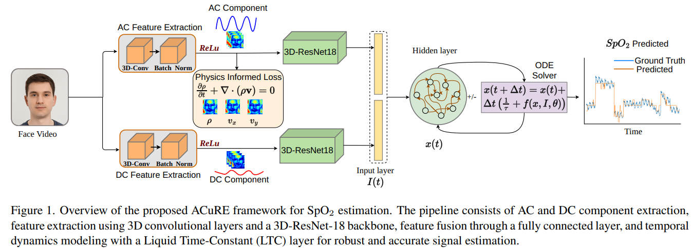
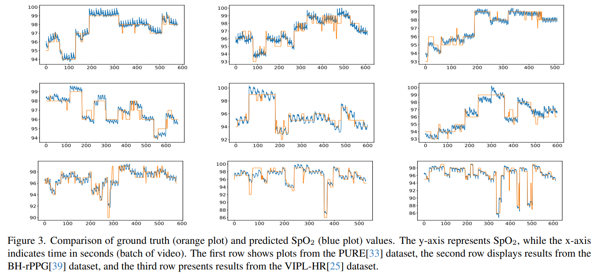
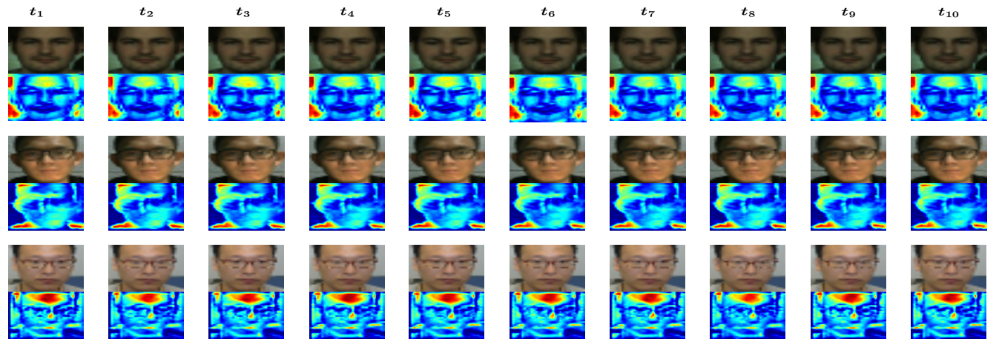

# 🫀 ACuRE: Accurate Continuity-Regularized SpO₂ Estimation Using Liquid Time-Constant Networks

> ## 🏆 **Accepted as Oral at WACV 2026**
> ## 📄 **Paper:** [ACuRE: Accurate Continuity-Regularized SpO₂ Estimation Using Liquid Time-Constant Networks](https://openaccess.thecvf.com/content/WACV2026/papers/Ahmad_ACuRE_Accurate_Continuity-Regularized_SpO2_Estimation_Using_Liquid_Time-Constant_Networks_WACV_2026_paper.pdf)

This repository contains the official implementation of our **WACV 2026 Oral** paper.


<!-- > **ACuRE: Accurate Continuity-Regularized SpO₂ Estimation Using Liquid Time-Constant Networks** -->

<!-- <p align="center">
  
</p> -->

---

## 📄 Paper Overview

The **ACuRE** framework introduces a **physics-informed and physiology-inspired** pipeline for accurate and robust **SpO₂ estimation from facial videos**.
It combines **AC/DC component separation**, **3D spatiotemporal feature extraction**, and **Liquid Time-Constant (LTC)**-based temporal modeling, guided by **continuity regularization** via a **physics-informed PDE loss**.

### 🧩 Key Highlights

* **AC/DC Decomposition:** Physiologically interpretable signal separation from facial video.
* **Physics-Informed Regularization:** Enforces **continuity constraints** (∂ρ/∂t + ∇·(ρv) = 0) for temporal consistency.
* **LTC Dynamics:** Recurrent ODE-based layer for adaptive temporal modeling.
* **Robust Estimation:** Outperforms state-of-the-art methods on **PURE**, **BH-rPPG**, and **VIPL-HR** datasets.

---

## 🧪 Framework Overview

<p align="center">
  
</p>

<!-- > **Figure:** Overview of ACuRE framework for SpO₂ estimation.
> The pipeline includes AC/DC feature extraction via 3D convolutions,
> physics-informed regularization, and temporal dynamics modeled with LTC. -->

---

## 📊 Experimental Results

<p align="center">
  
</p>

<!-- > **Figure:** Comparison of ground truth (orange) and predicted (blue) SpO₂ values across datasets. -->

---

## 🧠 Visualization of Learned Heat Flow

<p align="center">
  
</p>

> **Figure:** Visualization of spatiotemporal heat propagation learned across frames.

---

## 📦 Data Pre-processing

All training/testing scripts expect preprocessed `.npz` files with:
* `video`: spatio-temporal face crop sequence
* `wave`: synchronized SpO2 signal
* `fps`: frame rate

### 1) PURE
1. Open `data_preprocesing/PURE.py` and set:
   * `video_dir` (PURE videos)
   * `json_dir` (PURE JSON labels)
   * `output_dir` (where `.npz` files are saved)
   * `image_dir` (optional visualization output)
2. Run:

```bash
python data_preprocesing/PURE.py
```

### 2) BH-rPPG
Run preprocessing with input/output paths:

```bash
python data_preprocesing/BH_rPPG.py \
  --input /path/to/BH-rPPG_raw \
  --output /path/to/Bh_rPPG_dataset
```

### 3) VIPL-HR
Run preprocessing with input/output paths:

```bash
python data_preprocesing/VIPLR.py \
  --input /path/to/VIPL-HR_raw \
  --output /path/to/VIPLR_data_video
```

---

## 🚀 Training and Testing (Per Dataset)

Before running each script, update dataset/result paths in the `if __name__ == "__main__":` block at the bottom of that file.

### PURE

```bash
# Train (5-fold)
python PURE/PURE_training.py

# Test using saved best weights
python PURE/PURE_test.py

# Optional conditional evaluation split
python PURE/PURE_conditional_eval.py
```

### BH-rPPG

```bash
# Train (5-fold)
python BHRPPG/BHRPPG_training.py

# Test using saved best weights
python BHRPPG/BHRPPG_test.py

# Optional conditional evaluation split
python BHRPPG/BHRPPG_conditional_eval.py
```

### VIPL-HR

```bash
# Train (5-fold)
python VIPLR/VIPLR_training.py

# Test using saved best weights
python VIPLR/VIPLR_testing.py
```

## 📚 Citation

If you find this work useful, please cite:

```bibtex
@InProceedings{Ahmad_2026_WACV,
    author    = {Ahmad, Shahzad and Mishra, Divya and Bano, Sania and Chanda, Sukalpa and Rawat, Yogesh Singh},
    title     = {ACuRE: Accurate Continuity-Regularized SpO2 Estimation Using Liquid Time-Constant Networks},
    booktitle = {Proceedings of the IEEE/CVF Winter Conference on Applications of Computer Vision (WACV)},
    month     = {March},
    year      = {2026},
    pages     = {7250-7259}
}

```

---

## 🏛️ Acknowledgements

This work was conducted at **Østfold University** in collaboration with **UCF**.
We thank the authors of PURE, BH-rPPG, and VIPL-HR datasets for making their data publicly available.
